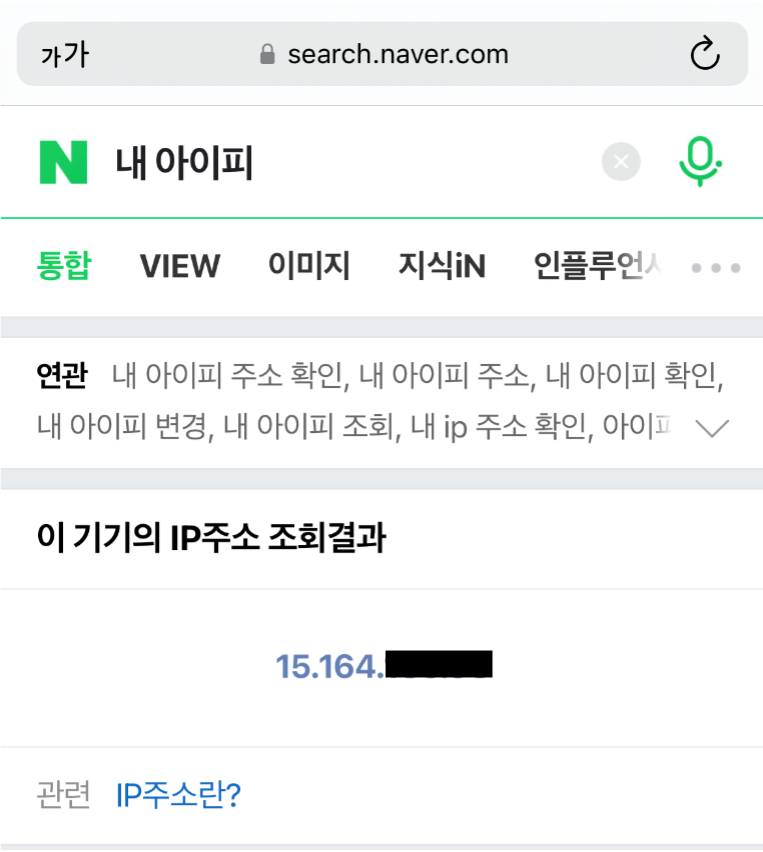

# Overview

오픈소스 VPN 프로토콜을 이용한 신뢰할 수 있는 VPN 서버 개발

# VPN 프로토콜
>   L2TP (Layer 2 Tunneling Protocol)  
>   IPsec (Internet Protocal Security)

# 서버 구축
>   AWS EC2  
>   Ubuntu Linux 22.04

# 연결

AWS에 구축한 서버의 IP 주소

 

VPN에 접속한 후 확인한 IP 주소

 